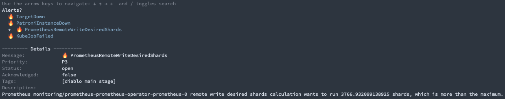

# Opsgenie

Opsgenie is a command line application to show, acknowlege, close and snooze Opsgenie alerts.



## Installation

The latest version can be downloaded from [https://github.com/ricoberger/opsgenie/releases](https://github.com/ricoberger/opsgenie/releases).

```sh
VERSION=
GOOS=$(go env GOOS)
GOARCH=$(go env GOARCH)
wget https://github.com/ricoberger/opsgenie/releases/download/$VERSION/opsgenie-$GOOS-$GOARCH
sudo install -m 755 opsgenie-$GOOS-$GOARCH /usr/local/bin/opsgenie
```

## Configuration

By default the application looks for a configuration file named `.opsgenie.yaml` in the home folder. This can be overwritten with the `--config` flag.

```yaml
# API Key for Opsgenie
apiKey:
# API URL must be api.opsgenie.com, api.eu.opsgenie.com or api.sandbox.opsgenie.com
apiUrl:
# Display name of the request owner
user:
# Templates for the alerts list. To render the list Go templating is use. All fields from the GetAlertResult struct are supported (https://pkg.go.dev/github.com/opsgenie/opsgenie-go-sdk-v2@v1.1.1/alert?tab=doc#GetAlertResult).
templates:
  active: |
    →  {{ .Message | blue }}
  inactive: |
    {{ .Message | blue }
  selected: |
    {{ .Message | red }}
  details: |
    --------- Details ----------
    {{ "Message:" | faint }}	{{ .Message }}
    {{ "Priority:" | faint }}	{{ .Priority }}
    {{ "Status:" | faint }}	{{ .Status }}
    {{ "Acknowledged:" | faint }}	{{ .Acknowledged }}
    {{ "Tags:" | faint }}	{{ .Tags }}
    {{ "Description:" | faint }}
    {{ .Description }}
```
